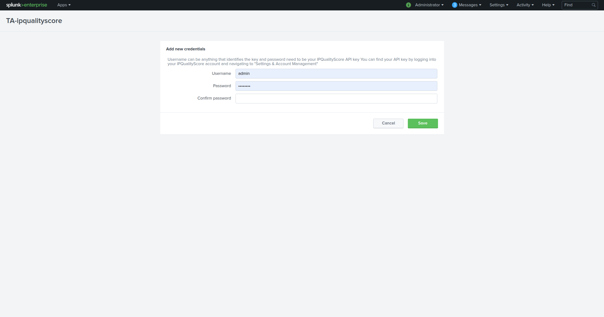

Configuration and usage
#######################

Global configuration
====================

**Once the application has been deployed, admins or power users will be presented with the setup screen to enter IPQualityScore API Key. You can access the same setup page at a later point by going to Splunk > (Gear Icon) > Manage Apps > Setup (next to IPQualityScore Addon for Splunk)**

*Setup Page:*

- ** Username:**

This defines the identifier for the API key. It is required for Splunk internally and does not have to match your IPQualityScore username

- ** Password:**

This defines the IPQualityScore API key. The key will be hidden from user view and will be encrypted before being stored in Splunk.