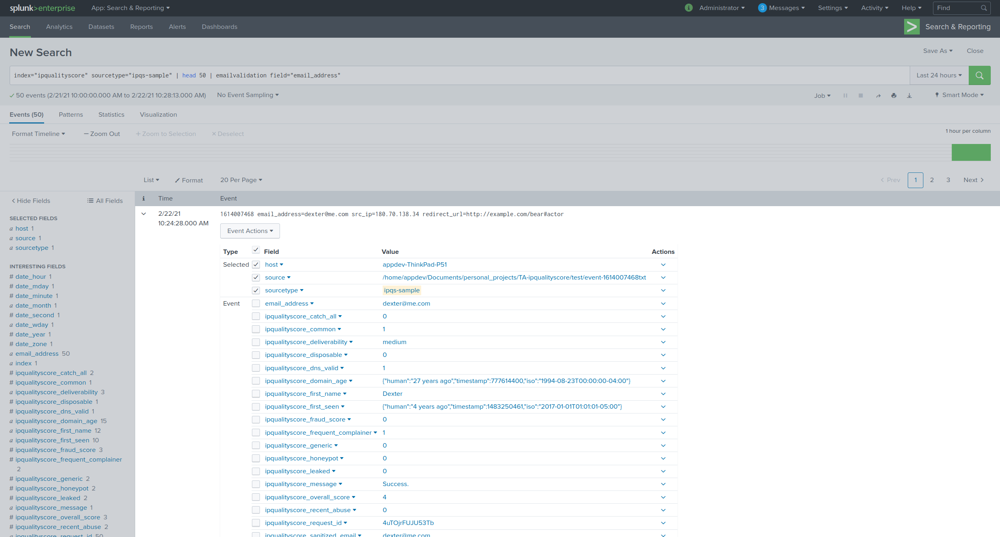

Email Validation
################

This commands maps to Email Validation API for IPQualityScore available [here](https://www.ipqualityscore.com/documentation/email-validation/overview). This custom command can help in following use cases

- **Low Quality Users** - Identify duplicate user accounts, bogus user information, and fake registrations. Automatically prevent low quality users from hurting your ROI.
- **Chargebacks & Payment Fraud** - Prevent chargebacks, high risk transactions, and all types of ecommerce payment fraud.
- **Lead Generation & User Data Verification** - Ensure data that you are collecting or purchasing is valid, accurate, and fresh using real-time email risk scoring.
- **List Cleaning** - Cleanse your email lists by removing invalid and inactive email addresses to ensure healthy bounce rates. Allow your promotional email to have the best chance of inboxing and reaching your clients.
- **Spam Traps** - Identify spam traps and honeypot email addresses that negatively impact your sender score.
- **Hard Bounces** - Prevent hard bounces by pre-screening email addresses before messaging them.
- **Disposable Email Services** - Easily block disposable email addresses and temporary mail services that allow fraudsters to spawn new emails at any time.

Following fields will be added to the event if the API call is successful

+---------------------+-----------------------------------------------------------------------------------------------------------------------------------------------------------------------------------------------------------------------------------------------------------------------------------------------------------------------------------------------------------+------------------+
| Field               | Description                                                                                                                                                                                                                                                                                                                                               | Possible Values  |
+=====================+===========================================================================================================================================================================================================================================================================================================================================================+==================+
| valid               | Does this email address appear valid?                                                                                                                                                                                                                                                                                                                     | boolean          |
+---------------------+-----------------------------------------------------------------------------------------------------------------------------------------------------------------------------------------------------------------------------------------------------------------------------------------------------------------------------------------------------------+------------------+
| disposable          | Is this email suspected of belonging to a temporary or disposable mail service? Usually associated with fraudsters and scammers.                                                                                                                                                                                                                          | boolean          |
+---------------------+-----------------------------------------------------------------------------------------------------------------------------------------------------------------------------------------------------------------------------------------------------------------------------------------------------------------------------------------------------------+------------------+
| timed_out           | Did the connection to the mail service provider timeout during the verification? If so, we recommend increasing the "timeout" variable above the default 7 second value. Lookups that timeout with a "valid" result as false are most likely false and should be not be trusted.                                                                          | boolean          |
+---------------------+-----------------------------------------------------------------------------------------------------------------------------------------------------------------------------------------------------------------------------------------------------------------------------------------------------------------------------------------------------------+------------------+
| deliverability      | How likely is this email to be delivered to the user and land in their mailbox. Values can be "high", "medium", or "low".                                                                                                                                                                                                                                 | string           |
+---------------------+-----------------------------------------------------------------------------------------------------------------------------------------------------------------------------------------------------------------------------------------------------------------------------------------------------------------------------------------------------------+------------------+
| catch_all           | Is this email likely to be a "catch all" where the mail server verifies all emails tested against it as valid? It is difficult to determine if the address is truly valid in these scenarios, since the email's server will not confirm the account's status.                                                                                             | boolean          |
+---------------------+-----------------------------------------------------------------------------------------------------------------------------------------------------------------------------------------------------------------------------------------------------------------------------------------------------------------------------------------------------------+------------------+
| leaked              | Was this email address associated with a recent database leak from a third party? Leaked accounts pose a risk as they may have become compromised during a database breach.                                                                                                                                                                               | boolean          |
+---------------------+-----------------------------------------------------------------------------------------------------------------------------------------------------------------------------------------------------------------------------------------------------------------------------------------------------------------------------------------------------------+------------------+
| suspect             | This value indicates if the mail server is currently replying with a temporary error and unable to verify the email address. This status will also be true for "catch all" email addresses as defined below. If this value is true, then we suspect the "valid" result may be tainted and there is not a guarantee that the email address is truly valid. | boolean          |
+---------------------+-----------------------------------------------------------------------------------------------------------------------------------------------------------------------------------------------------------------------------------------------------------------------------------------------------------------------------------------------------------+------------------+
| smtp_score          | Validity score of email server's SMTP setup. Range: "-1" - "3". Scores above "-1" can be associated with a valid email.                                                                                                                                                                                                                                   | integer          |
+---------------------+-----------------------------------------------------------------------------------------------------------------------------------------------------------------------------------------------------------------------------------------------------------------------------------------------------------------------------------------------------------+------------------+
| overall_score       | Overall email validity score. Range: "0" - "4". Scores above "1" can be associated with a valid email.                                                                                                                                                                                                                                                    | integer          |
+---------------------+-----------------------------------------------------------------------------------------------------------------------------------------------------------------------------------------------------------------------------------------------------------------------------------------------------------------------------------------------------------+------------------+
| first_name          | Suspected first name based on email. Returns "CORPORATE" if the email is suspected of being a generic company email. Returns "UNKNOWN" if the first name was not determinable.                                                                                                                                                                            | string           |
+---------------------+-----------------------------------------------------------------------------------------------------------------------------------------------------------------------------------------------------------------------------------------------------------------------------------------------------------------------------------------------------------+------------------+
| common              | Is this email from a common email provider? ("gmail.com", "yahoo.com", "hotmail.com", etc.)                                                                                                                                                                                                                                                               | boolean          |
+---------------------+-----------------------------------------------------------------------------------------------------------------------------------------------------------------------------------------------------------------------------------------------------------------------------------------------------------------------------------------------------------+------------------+
| generic             | Is this email suspected as being a catch all or shared email for a domain? ("admin@", "webmaster@", "newsletter@", "sales@", "contact@", etc.)                                                                                                                                                                                                            | boolean          |
+---------------------+-----------------------------------------------------------------------------------------------------------------------------------------------------------------------------------------------------------------------------------------------------------------------------------------------------------------------------------------------------------+------------------+
| dns_valid           | Does the email's hostname have valid DNS entries? Partial indication of a valid email.                                                                                                                                                                                                                                                                    | boolean          |
+---------------------+-----------------------------------------------------------------------------------------------------------------------------------------------------------------------------------------------------------------------------------------------------------------------------------------------------------------------------------------------------------+------------------+
| honeypot            | Is this email believed to be a "honeypot" or "SPAM trap"? Bulk mail sent to these emails increases your risk of being blacklisted by large ISPs & ending up in the spam folder.                                                                                                                                                                           | boolean          |
+---------------------+-----------------------------------------------------------------------------------------------------------------------------------------------------------------------------------------------------------------------------------------------------------------------------------------------------------------------------------------------------------+------------------+
| spam_trap_score     | Confidence level of the email address being an active SPAM trap. Values can be "high", "medium", "low", or "none". We recommend scrubbing emails with "high" or "medium" statuses. Avoid "low" emails whenever possible for any promotional mailings.                                                                                                     | string           |
+---------------------+-----------------------------------------------------------------------------------------------------------------------------------------------------------------------------------------------------------------------------------------------------------------------------------------------------------------------------------------------------------+------------------+
| recent_abuse        | This value will indicate if there has been any recently verified abuse across our network for this email address. Abuse could be a confirmed chargeback, fake signup, compromised device, fake app install, or similar malicious behavior within the past few days.                                                                                       | boolean          |
+---------------------+-----------------------------------------------------------------------------------------------------------------------------------------------------------------------------------------------------------------------------------------------------------------------------------------------------------------------------------------------------------+------------------+
| fraud_score         | The overall Fraud Score of the user based on the email's reputation and recent behavior across the IPQS threat network. Fraud Scores >= 75 are suspicious, but not necessarily fraudulent.                                                                                                                                                                | float            |
+---------------------+-----------------------------------------------------------------------------------------------------------------------------------------------------------------------------------------------------------------------------------------------------------------------------------------------------------------------------------------------------------+------------------+
| frequent_complainer | Indicates if this email frequently unsubscribes from marketing lists or reports email as SPAM.                                                                                                                                                                                                                                                            | boolean          |
+---------------------+-----------------------------------------------------------------------------------------------------------------------------------------------------------------------------------------------------------------------------------------------------------------------------------------------------------------------------------------------------------+------------------+
| suggested_domain    | Default value is "N/A". Indicates if this email's domain should in fact be corrected to a popular mail service. This field is useful for catching user typos. For example, an email address with "gmai.com", would display a suggested domain of "gmail.com". This feature supports all major mail service providers.                                     | string           |
+---------------------+-----------------------------------------------------------------------------------------------------------------------------------------------------------------------------------------------------------------------------------------------------------------------------------------------------------------------------------------------------------+------------------+
| first_seen          |                                                                                                                                                                                                                                                                                                                                                           | object           |
+---------------------+-----------------------------------------------------------------------------------------------------------------------------------------------------------------------------------------------------------------------------------------------------------------------------------------------------------------------------------------------------------+------------------+
| domain_age          |                                                                                                                                                                                                                                                                                                                                                           | object           |
+---------------------+-----------------------------------------------------------------------------------------------------------------------------------------------------------------------------------------------------------------------------------------------------------------------------------------------------------------------------------------------------------+------------------+
| sanitized_email     | Sanitized email address with all aliases and masking removed, such as multiple periods for Gmail.com.                                                                                                                                                                                                                                                     | string           |
+---------------------+-----------------------------------------------------------------------------------------------------------------------------------------------------------------------------------------------------------------------------------------------------------------------------------------------------------------------------------------------------------+------------------+
| request_id          | A unique identifier for this request that can be used to lookup the request details or send a postback conversion notice.                                                                                                                                                                                                                                 | string           |
+---------------------+-----------------------------------------------------------------------------------------------------------------------------------------------------------------------------------------------------------------------------------------------------------------------------------------------------------------------------------------------------------+------------------+
| success             | Was the request successful?                                                                                                                                                                                                                                                                                                                               | boolean          |
+---------------------+-----------------------------------------------------------------------------------------------------------------------------------------------------------------------------------------------------------------------------------------------------------------------------------------------------------------------------------------------------------+------------------+
| message             | A generic status message, either success or some form of an error notice.                                                                                                                                                                                                                                                                                 | string           |
+---------------------+-----------------------------------------------------------------------------------------------------------------------------------------------------------------------------------------------------------------------------------------------------------------------------------------------------------------------------------------------------------+------------------+
| errors              | Array of errors which occurred while attempting to process this request.                                                                                                                                                                                                                                                                                  | array of strings |
+---------------------+-----------------------------------------------------------------------------------------------------------------------------------------------------------------------------------------------------------------------------------------------------------------------------------------------------------------------------------------------------------+------------------+

Syntax
------

    ... | emailvalidation field=<field_name> [fast=(true|false)] [timeout=<int>] [suggest_domain=(true|false)] [strictness=<int>] [abuse_strictness=<int>]
    
Required arguments
^^^^^^^^^^^^^^^^^^

| **field**
|   **Syntax**: field=<field_name>
|   **Description**: Field name containing email address 

Optional arguments
^^^^^^^^^^^^^^^^^^
| **fast**
|   **Syntax**: fast=<boolean>
|   **Description**: When this parameter is enabled our API will not perform an SMTP check with the mail service provider, which greatly increases the API speed. Syntax and DNS checks are still performed on the email address as well as our disposable email detection service. This option is intended for services that require decision making in a time sensitive manner.
|   **Possible values**: (true|false)
|   **Default**: true

| **timeout**
|   **Syntax**: timeout=<int>
|   **Description**: Maximum number of seconds to wait for a reply from a mail service provider. If your implementation requirements do not need an immediate response, we recommend bumping this value to 20. Any results which experience a connection timeout will return the "timed_out" variable as true.
|   **Possible values**: 1-60
|   **Default**: 7

| **suggest_domain**
|   **Syntax**: suggest_domain=<boolean>
|   **Description**: Force analyze if the email address's domain has a typo and should be corrected to a popular mail service. By default, this test is currently only performed when the email is invalid or if the "recent abuse" status is true.
|   **Possible values**: (true|false)
|   **Default**: false

| **strictness**
|   **Syntax**: strictness=<int>
|   **Description**: Sets how strictly spam traps and honeypots are detected by our system, depending on how comfortable you are with identifying emails suspected of being a spam trap. 0 is the lowest level which will only return spam traps with high confidence. Strictness levels above 0 will return increasingly more strict results, with level 2 providing the greatest detection rates.
|   **Possible values**: 0-3
|   **Default**: 0

| **abuse_strictness**
|   **Syntax**: abuse_strictness=<int>
|   **Description**: Set the strictness level for machine learning pattern recognition of abusive email addresses with the "recent_abuse" data point. Default level of 0 provides good coverage, however if you are filtering account applications and facing advanced fraudsters then we recommend increasing this value to level 1 or 2.
|   **Possible values**: 0-2
|   **Default**: 0

Example Usage
-------------

|   ... | emailvalidation field="email_address"

|   ... | emailvalidation field="email_address" strictness=2 timeout=30

