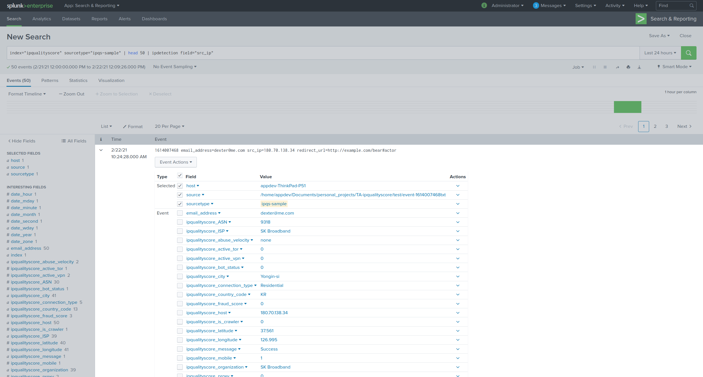

IP Detection
############

This commands maps to Proxy & VPN Detection API for IPQualityScore available [here](https://www.ipqualityscore.com/documentation/proxy-detection/overview). This custom command can help in following use cases

- **Low Quality Users** - Identify duplicate user accounts, bogus user information, and fake registrations. Automatically prevent low quality users from hurting your ROI.
- **Chargebacks & Payment Fraud** - Prevent chargebacks, high risk transactions, and all types of ecommerce fraud.
- **Click Fraud & Invalid Clicks** - Solve click fraud quality issues with real-time click filtering and ensure only high quality clicks. Stop all forms of invalid traffic.
- **IP Reputation** - Analyze IP Address reputation to detect proxies, VPNs, and TOR connections and determine the likeliness of fraudulent activity.
- **Account Takeover** - Monitor accounts for unusual behavior and session hijacking attempts.
- **Bot Detection** - Filter non-human traffic in real-time with IPQS bot detection tools.
- **Geo Filtering** - Prevent users from bypassing requirements and conditions for accessing content outside their country of residence.
- **High Risk Behavior** - Analyze user behavior against millions of high risk patterns that indicate a user's intent to engage in fraudulent activity.
- **Lead Generation & User Data Verification** - Ensure data that you are collecting is valid, accurate, and fresh.

Following fields will be added to the event if the command is executed successfully

+------------------------------+-------------------------------------------------------------------------------------------------------------------------------------------------------------------------------------------------------------------------------------------------------------------------------------------------------------------------------------------------------------------------------------------------------------------------------------------------------------------------------------------------------------------------------------------------------------------------------------------------------------------------+------------------+
| Field                        | Description                                                                                                                                                                                                                                                                                                                                                                                                                                                                                                                                                                                                             | Possible Values  |
+==============================+=========================================================================================================================================================================================================================================================================================================================================================================================================================================================================================================================================================================================================================+==================+
| proxy                        | Is this IP address suspected to be a proxy? (SOCKS, Elite, Anonymous, VPN, Tor, etc.)                                                                                                                                                                                                                                                                                                                                                                                                                                                                                                                                   | boolean          |
+------------------------------+-------------------------------------------------------------------------------------------------------------------------------------------------------------------------------------------------------------------------------------------------------------------------------------------------------------------------------------------------------------------------------------------------------------------------------------------------------------------------------------------------------------------------------------------------------------------------------------------------------------------------+------------------+
| host                         | Hostname of the IP address if one is available.                                                                                                                                                                                                                                                                                                                                                                                                                                                                                                                                                                         | string           |
+------------------------------+-------------------------------------------------------------------------------------------------------------------------------------------------------------------------------------------------------------------------------------------------------------------------------------------------------------------------------------------------------------------------------------------------------------------------------------------------------------------------------------------------------------------------------------------------------------------------------------------------------------------------+------------------+
| ISP                          | ISP if one is known. Otherwise "N/A".                                                                                                                                                                                                                                                                                                                                                                                                                                                                                                                                                                                   | string           |
+------------------------------+-------------------------------------------------------------------------------------------------------------------------------------------------------------------------------------------------------------------------------------------------------------------------------------------------------------------------------------------------------------------------------------------------------------------------------------------------------------------------------------------------------------------------------------------------------------------------------------------------------------------------+------------------+
| Organization                 | Organization if one is known. Can be parent company or sub company of the listed ISP. Otherwise "N/A".                                                                                                                                                                                                                                                                                                                                                                                                                                                                                                                  | string           |
+------------------------------+-------------------------------------------------------------------------------------------------------------------------------------------------------------------------------------------------------------------------------------------------------------------------------------------------------------------------------------------------------------------------------------------------------------------------------------------------------------------------------------------------------------------------------------------------------------------------------------------------------------------------+------------------+
| ASN                          | Autonomous System Number if one is known. Null if nonexistent.                                                                                                                                                                                                                                                                                                                                                                                                                                                                                                                                                          | integer          |
+------------------------------+-------------------------------------------------------------------------------------------------------------------------------------------------------------------------------------------------------------------------------------------------------------------------------------------------------------------------------------------------------------------------------------------------------------------------------------------------------------------------------------------------------------------------------------------------------------------------------------------------------------------------+------------------+
| country_code                 | Two character country code of IP address or "N/A" if unknown.                                                                                                                                                                                                                                                                                                                                                                                                                                                                                                                                                           | string           |
+------------------------------+-------------------------------------------------------------------------------------------------------------------------------------------------------------------------------------------------------------------------------------------------------------------------------------------------------------------------------------------------------------------------------------------------------------------------------------------------------------------------------------------------------------------------------------------------------------------------------------------------------------------------+------------------+
| city                         | City of IP address if available or "N/A" if unknown.                                                                                                                                                                                                                                                                                                                                                                                                                                                                                                                                                                    | string           |
+------------------------------+-------------------------------------------------------------------------------------------------------------------------------------------------------------------------------------------------------------------------------------------------------------------------------------------------------------------------------------------------------------------------------------------------------------------------------------------------------------------------------------------------------------------------------------------------------------------------------------------------------------------------+------------------+
| region                       | Region (state) of IP address if available or "N/A" if unknown.                                                                                                                                                                                                                                                                                                                                                                                                                                                                                                                                                          | string           |
+------------------------------+-------------------------------------------------------------------------------------------------------------------------------------------------------------------------------------------------------------------------------------------------------------------------------------------------------------------------------------------------------------------------------------------------------------------------------------------------------------------------------------------------------------------------------------------------------------------------------------------------------------------------+------------------+
| timezone                     | Timezone of IP address if available or "N/A" if unknown.                                                                                                                                                                                                                                                                                                                                                                                                                                                                                                                                                                | string           |
+------------------------------+-------------------------------------------------------------------------------------------------------------------------------------------------------------------------------------------------------------------------------------------------------------------------------------------------------------------------------------------------------------------------------------------------------------------------------------------------------------------------------------------------------------------------------------------------------------------------------------------------------------------------+------------------+
| latitude                     | Latitude of IP address if available or "N/A" if unknown.                                                                                                                                                                                                                                                                                                                                                                                                                                                                                                                                                                | float            |
+------------------------------+-------------------------------------------------------------------------------------------------------------------------------------------------------------------------------------------------------------------------------------------------------------------------------------------------------------------------------------------------------------------------------------------------------------------------------------------------------------------------------------------------------------------------------------------------------------------------------------------------------------------------+------------------+
| longitude                    | Longitude of IP address if available or "N/A" if unknown.                                                                                                                                                                                                                                                                                                                                                                                                                                                                                                                                                               | float            |
+------------------------------+-------------------------------------------------------------------------------------------------------------------------------------------------------------------------------------------------------------------------------------------------------------------------------------------------------------------------------------------------------------------------------------------------------------------------------------------------------------------------------------------------------------------------------------------------------------------------------------------------------------------------+------------------+
| is_crawler                   | Is this IP associated with being a confirmed crawler from a mainstream search engine such as Googlebot, Bingbot, Yandex, etc. based on hostname or IP address verification.                                                                                                                                                                                                                                                                                                                                                                                                                                             | boolean          |
+------------------------------+-------------------------------------------------------------------------------------------------------------------------------------------------------------------------------------------------------------------------------------------------------------------------------------------------------------------------------------------------------------------------------------------------------------------------------------------------------------------------------------------------------------------------------------------------------------------------------------------------------------------------+------------------+
| connection_type              | Classification of the IP address connection type as "Residential", "Corporate", "Education", "Mobile", or "Data Center".                                                                                                                                                                                                                                                                                                                                                                                                                                                                                                | string           |
+------------------------------+-------------------------------------------------------------------------------------------------------------------------------------------------------------------------------------------------------------------------------------------------------------------------------------------------------------------------------------------------------------------------------------------------------------------------------------------------------------------------------------------------------------------------------------------------------------------------------------------------------------------------+------------------+
| recent_abuse                 | This value will indicate if there has been any recently verified abuse across our network for this IP address. Abuse could be a confirmed chargeback, compromised device, fake app install, or similar malicious behavior within the past few days.                                                                                                                                                                                                                                                                                                                                                                     | boolean          |
+------------------------------+-------------------------------------------------------------------------------------------------------------------------------------------------------------------------------------------------------------------------------------------------------------------------------------------------------------------------------------------------------------------------------------------------------------------------------------------------------------------------------------------------------------------------------------------------------------------------------------------------------------------------+------------------+
| abuse_velocity               | Premium Account Feature - How frequently the IP address is engaging in abuse across the IPQS threat network. Values can be "high", "medium", "low", or "none". Can be used in combination with the Fraud Score to identify bad behavior.                                                                                                                                                                                                                                                                                                                                                                                | string           |
+------------------------------+-------------------------------------------------------------------------------------------------------------------------------------------------------------------------------------------------------------------------------------------------------------------------------------------------------------------------------------------------------------------------------------------------------------------------------------------------------------------------------------------------------------------------------------------------------------------------------------------------------------------------+------------------+
| bot_status                   | Premium Account Feature - Indicates if bots or non-human traffic has recently used this IP address to engage in automated fraudulent behavior. Provides stronger confidence that the IP address is suspicious.                                                                                                                                                                                                                                                                                                                                                                                                          | boolean          |
+------------------------------+-------------------------------------------------------------------------------------------------------------------------------------------------------------------------------------------------------------------------------------------------------------------------------------------------------------------------------------------------------------------------------------------------------------------------------------------------------------------------------------------------------------------------------------------------------------------------------------------------------------------------+------------------+
| vpn                          | Is this IP suspected of being a VPN connection? This can include data center ranges which can become active VPNs at any time. The "proxy" status will always be true when this value is true.                                                                                                                                                                                                                                                                                                                                                                                                                           | boolean          |
+------------------------------+-------------------------------------------------------------------------------------------------------------------------------------------------------------------------------------------------------------------------------------------------------------------------------------------------------------------------------------------------------------------------------------------------------------------------------------------------------------------------------------------------------------------------------------------------------------------------------------------------------------------------+------------------+
| tor                          | Is this IP suspected of being a TOR connection? This can include previously active TOR nodes and exits which can become active TOR exits at any time. The "proxy" status will always be true when this value is true.                                                                                                                                                                                                                                                                                                                                                                                                   | boolean          |
+------------------------------+-------------------------------------------------------------------------------------------------------------------------------------------------------------------------------------------------------------------------------------------------------------------------------------------------------------------------------------------------------------------------------------------------------------------------------------------------------------------------------------------------------------------------------------------------------------------------------------------------------------------------+------------------+
| active_vpn                   | Premium Account Feature - Identifies active VPN connections used by popular VPN services and private VPN servers.                                                                                                                                                                                                                                                                                                                                                                                                                                                                                                       | boolean          |
+------------------------------+-------------------------------------------------------------------------------------------------------------------------------------------------------------------------------------------------------------------------------------------------------------------------------------------------------------------------------------------------------------------------------------------------------------------------------------------------------------------------------------------------------------------------------------------------------------------------------------------------------------------------+------------------+
| active_tor                   | Premium Account Feature - Identifies active TOR exits on the TOR network.                                                                                                                                                                                                                                                                                                                                                                                                                                                                                                                                               | boolean          |
+------------------------------+-------------------------------------------------------------------------------------------------------------------------------------------------------------------------------------------------------------------------------------------------------------------------------------------------------------------------------------------------------------------------------------------------------------------------------------------------------------------------------------------------------------------------------------------------------------------------------------------------------------------------+------------------+
| mobile                       | Is this user agent a mobile browser? (will always be false if the user agent is not passed in the API request)                                                                                                                                                                                                                                                                                                                                                                                                                                                                                                          | boolean          |
+------------------------------+-------------------------------------------------------------------------------------------------------------------------------------------------------------------------------------------------------------------------------------------------------------------------------------------------------------------------------------------------------------------------------------------------------------------------------------------------------------------------------------------------------------------------------------------------------------------------------------------------------------------------+------------------+
| fraud_score                  | The overall fraud score of the user based on the IP, user agent, language, and any other optionally passed variables. Fraud Scores >= 75 are suspicious, but not necessarily fraudulent. We recommend flagging or blocking traffic with Fraud Scores >= 85, but you may find it beneficial to use a higher or lower threshold.                                                                                                                                                                                                                                                                                          | float            |
+------------------------------+-------------------------------------------------------------------------------------------------------------------------------------------------------------------------------------------------------------------------------------------------------------------------------------------------------------------------------------------------------------------------------------------------------------------------------------------------------------------------------------------------------------------------------------------------------------------------------------------------------------------------+------------------+
| request_id                   | A unique identifier for this request that can be used to lookup the request details or send a postback conversion notice.                                                                                                                                                                                                                                                                                                                                                                                                                                                                                               | string           |
+------------------------------+-------------------------------------------------------------------------------------------------------------------------------------------------------------------------------------------------------------------------------------------------------------------------------------------------------------------------------------------------------------------------------------------------------------------------------------------------------------------------------------------------------------------------------------------------------------------------------------------------------------------------+------------------+
| operating_system             | Operating system name and version or "N/A" if unknown. Requires the "user_agent" variable in the API Request.                                                                                                                                                                                                                                                                                                                                                                                                                                                                                                           | string           |
+------------------------------+-------------------------------------------------------------------------------------------------------------------------------------------------------------------------------------------------------------------------------------------------------------------------------------------------------------------------------------------------------------------------------------------------------------------------------------------------------------------------------------------------------------------------------------------------------------------------------------------------------------------------+------------------+
| browser                      | Browser name and version or "N/A" if unknown. Requires the "user_agent" variable in the API Request.                                                                                                                                                                                                                                                                                                                                                                                                                                                                                                                    | string           |
+------------------------------+-------------------------------------------------------------------------------------------------------------------------------------------------------------------------------------------------------------------------------------------------------------------------------------------------------------------------------------------------------------------------------------------------------------------------------------------------------------------------------------------------------------------------------------------------------------------------------------------------------------------------+------------------+
| device_brand                 | Brand name of the device or "N/A" if unknown. Requires the "user_agent" variable in the API Request.                                                                                                                                                                                                                                                                                                                                                                                                                                                                                                                    | string           |
+------------------------------+-------------------------------------------------------------------------------------------------------------------------------------------------------------------------------------------------------------------------------------------------------------------------------------------------------------------------------------------------------------------------------------------------------------------------------------------------------------------------------------------------------------------------------------------------------------------------------------------------------------------------+------------------+
| device_model                 | Model name of the device or "N/A" if unknown. Requires the "user_agent" variable in the API Request.                                                                                                                                                                                                                                                                                                                                                                                                                                                                                                                    | string           |
+------------------------------+-------------------------------------------------------------------------------------------------------------------------------------------------------------------------------------------------------------------------------------------------------------------------------------------------------------------------------------------------------------------------------------------------------------------------------------------------------------------------------------------------------------------------------------------------------------------------------------------------------------------------+------------------+
| transaction_details (object) | Additional scoring variables for risk analysis are available when transaction scoring data is passed through the API request. These variables are also useful for scoring user data such as physical addresses, phone numbers, usernames, and transaction details. The data points below are populated when at least 1 transaction data parameter is present in the initial API request. The following transaction variables are "null" when the necessary transaction parameters are not passed with the initial API request. For instance, not passing the "billing_email" will return "valid_billing_email" as null. |                  |
+------------------------------+-------------------------------------------------------------------------------------------------------------------------------------------------------------------------------------------------------------------------------------------------------------------------------------------------------------------------------------------------------------------------------------------------------------------------------------------------------------------------------------------------------------------------------------------------------------------------------------------------------------------------+------------------+
| message                      | A generic status message, either success or some form of an error notice.                                                                                                                                                                                                                                                                                                                                                                                                                                                                                                                                               | string           |
+------------------------------+-------------------------------------------------------------------------------------------------------------------------------------------------------------------------------------------------------------------------------------------------------------------------------------------------------------------------------------------------------------------------------------------------------------------------------------------------------------------------------------------------------------------------------------------------------------------------------------------------------------------------+------------------+
| success                      | Was the request successful?                                                                                                                                                                                                                                                                                                                                                                                                                                                                                                                                                                                             | boolean          |
+------------------------------+-------------------------------------------------------------------------------------------------------------------------------------------------------------------------------------------------------------------------------------------------------------------------------------------------------------------------------------------------------------------------------------------------------------------------------------------------------------------------------------------------------------------------------------------------------------------------------------------------------------------------+------------------+
| errors                       | Array of errors which occurred while attempting to process this request.                                                                                                                                                                                                                                                                                                                                                                                                                                                                                                                                                | array of strings |
+------------------------------+-------------------------------------------------------------------------------------------------------------------------------------------------------------------------------------------------------------------------------------------------------------------------------------------------------------------------------------------------------------------------------------------------------------------------------------------------------------------------------------------------------------------------------------------------------------------------------------------------------------------------+------------------+

Syntax
------

    ... | ipdetection field=<field_name> [strictness=<int>] [user_agent=<string>] [user_language=<string>] [fast=(true|false)] [mobile=(true|false)] [allow_public_access_points=(true|false)] [lighter_penalties=(true|false)] [transaction_strictness=<int>]

Required arguments
^^^^^^^^^^^^^^^^^^

| **field**
|   **Syntax**: field=<field_name>
|   **Description**: Field name containing IPv4 address 

Optional arguments
^^^^^^^^^^^^^^^^^^

| **strictness**
|   **Syntax**: strictness=<int>
|   **Description**: How in depth (strict) do you want this query to be? Higher values take longer to process and may provide a higher false-positive rate. We recommend starting at “0”, the lowest strictness setting, and increasing to “1” or “2” depending on your levels of fraud.
|   **Possible values**: 0-3
|   **Default**: 0

| **user_agent**
|   **Syntax**: user_agent=<string>
|   **Description**: You can optionally provide us with the user agent string (browser). This allows us to run additional checks to see if the user is a bot or running an invalid browser. This allows us to evaluate the risk of the user as judged in the "fraud_score".
|   **Default**: null

| **user_language**
|   **Syntax**: user_language=<string>
|   **Description**: You can optionally provide us with the user's language header. This allows us to evaluate the risk of the user as judged in the "fraud_score".
|   **Default**: null

| **fast**
|   **Syntax**: fast=<boolean>
|   **Description**: When this parameter is enabled our API will not perform certain forensic checks that take longer to process. Enabling this feature greatly increases the API speed without much impact on accuracy. This option is intended for services that require decision making in a time sensitive manner and can be used for any strictness level.
|   **Possible values**: (true|false)
|   **Default**: true

| **mobile**
|   **Syntax**: mobile=<boolean>
|   **Description**: You can optionally specify that this lookup should be treated as a mobile device. Recommended for mobile lookups that do not have a user agent attached to the request. NOTE: This can cause unexpected and abnormal results if the device is not a mobile device.
|   **Possible values**: (true|false)
|   **Default**: false

| **allow_public_access_points**
|   **Syntax**: allow_public_access_points=<boolean>
|   **Description**: Bypasses certain checks for IP addresses from education and research institutions, schools, and some corporate connections to better accommodate audiences that frequently use public connections.
|   **Possible values**: (true|false)
|   **Default**: true

| **lighter_penalties**
|   **Syntax**: lighter_penalties=<boolean>
|   **Description**: Is your scoring too strict? Enable this setting to lower detection rates and Fraud Scores for mixed quality IP addresses. If you experience any false-positives with your traffic then enabling this feature will provide better results.
|   **Possible values**: (true|false)
|   **Default**: true

| **transaction_strictness**
|   **Syntax**: transaction_strictness=<int>
|   **Description**: Adjusts the weights for penalties applied due to irregularities and fraudulent patterns detected on order and transaction details that can be optionally provided on each API request. This feature is only beneficial if you are passing order and transaction details. A table is available further down the page with supported transaction variables.
|   **Possible values**: 0-2
|   **Default**: 0

Example Usage
-------------

|   ... | ipdetection field="src_ip"

|   ... | ipdetection field="src_ip" strictness=2 fast=true

